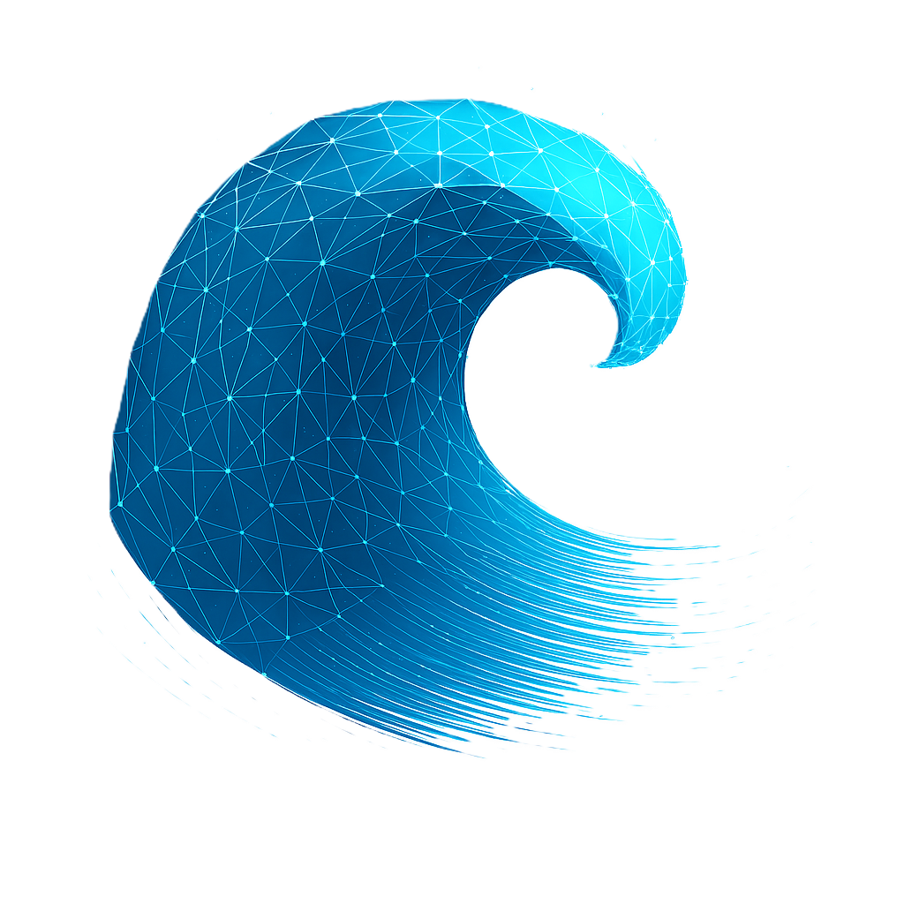

<html lang="en">
<head>
  <meta charset="utf-8" />
  <meta name="viewport" content="width=device-width,initial-scale=1" />
  <title>Wave Tracker</title>
  <link rel="stylesheet" href="style.css">
  <link rel="icon" type="image/png" href="logo.png">
  
</head>
<body>
  

    

      <h1> Wave Tracker</h1>
      
Track It. Ride It. Own It.

    

    

      <!-- Video upload and detection section -->
      

        <h2 class="section-title">⬆️ Upload your video & detect waves</h2>
        

          

            <label for="videoInput">Upload video:</label>
            <input id="videoInput" type="file" accept="video/*" />
            <button id="detectBtn" class="btn-primary">Detect Waves</button>
            <button id="clearVideoBtn" class="btn-secondary">Clear video</button>
          

        

        

        

          <video id="videoPlayer" controls preload="metadata"></video>
        

      

      <!-- Filter and analysis section -->
      

        <h2 class="section-title">🔍 Filter & Analysis</h2>
        

          

            <label>Min duration (s):</label>
            <input id="minDuration" type="number" step="0.5" placeholder="0.00" />
          

          

            <label>Max duration (s):</label>
            <input id="maxDuration" type="number" step="0.5" placeholder="10.00" />
          

          <button id="loadBtn" class="btn-primary">Load data</button>
          <button id="clearBtn" class="btn-secondary">Clear filter</button>
          <button id="clearFramesBtn" class="btn-danger">Clear frames</button>
          <button id="clearDbBtn" class="btn-danger" style="background-color: #d32f2f;">Clear Database</button>
          

        

      

      <!-- Results table section -->
      

        <h2 class="section-title">📊 Detection Results</h2>
        <table id="tbl">
          <thead>
                <tr>
                  <th>Wave ID</th>
                  <th>Tracking duration (s)</th>
                  <th>Video timestamp</th>
                  <th>Start Position (x,y)</th>
                  <th>Action</th>
                </tr>
          </thead>
          <tbody></tbody>
        </table>
      

    

  

  
</body>
</html>
